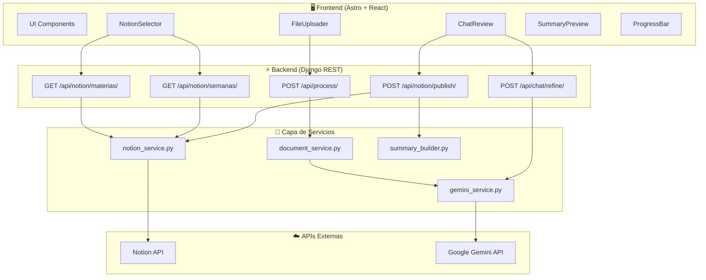

# 🏗️ EduSync AI — Arquitectura del Sistema

## Estructura del Proyecto

```
d:\EduSync AI\
├── docs/                         # Documentación de contexto
├── frontend/                     # Astro (SSR mode) + React Islands
│   ├── astro.config.mjs
│   ├── package.json
│   ├── public/
│   │   └── fonts/
│   ├── src/
│   │   ├── layouts/
│   │   │   └── Layout.astro         # Base layout (dark theme, fonts)
│   │   ├── pages/
│   │   │   └── index.astro          # Main single-page app
│   │   ├── components/
│   │   │   ├── NotionSelector.jsx   # Curso + Semana selectors
│   │   │   ├── FileUploader.jsx     # Drag & drop upload
│   │   │   ├── ChatReview.jsx       # Review chat panel
│   │   │   ├── SummaryPreview.jsx   # Rich summary preview
│   │   │   ├── ProgressBar.jsx      # Processing status indicator
│   │   │   └── Header.jsx           # App header/branding
│   │   └── styles/
│   │       └── global.css           # Tailwind v4 + design tokens (@theme)
│   └── .env                         # PUBLIC_API_URL
│
├── backend/                      # Django REST Framework
│   ├── manage.py
│   ├── requirements.txt
│   ├── edusync/                  # Django project config
│   │   ├── settings.py
│   │   ├── urls.py
│   │   └── wsgi.py
│   ├── api/                      # Django app principal
│   │   ├── views.py              # Controladores de endpoints
│   │   ├── urls.py               # Rutas de la API
│   │   ├── serializers.py        # Validación de request/response
│   │   ├── services/
│   │   │   ├── notion_service.py     # CRUD con Notion API
│   │   │   ├── gemini_service.py     # Procesamiento con Gemini
│   │   │   ├── document_service.py   # Extracción de documentos
│   │   │   └── summary_builder.py    # Generador de bloques Notion
│   │   └── utils/
│   │       └── notion_blocks.py      # Helpers para bloques Notion
│   └── .env                      # API keys (NOTION_TOKEN, GEMINI_API_KEY, etc.)
│
└── README.md
```

## Diagrama de Arquitectura



## API Endpoints

### Notion Endpoints (Lectura)

| Método | Endpoint | Descripción | Request | Response |
|--------|----------|-------------|---------|----------|
| `GET` | `/api/notion/materias/` | Obtener lista de materias | — | `{ materias: ["SEGURIDAD INFORMÁTICA", ...] }` |
| `GET` | `/api/notion/semanas/?materia=X` | Obtener semanas de una materia | Query param: `materia` | `{ semanas: [{id, nombre}, ...] }` |

### Procesamiento Endpoints

| Método | Endpoint | Descripción | Request | Response |
|--------|----------|-------------|---------|----------|
| `POST` | `/api/process/` | Procesar archivos con IA | `multipart/form-data` (files[]) | `{ summary: {...}, raw_text: "..." }` |
| `POST` | `/api/chat/refine/` | Refinar resumen vía chat | `{ summary: {...}, message: "..." }` | `{ summary: {...}, ai_response: "..." }` |

### Notion Endpoints (Escritura)

| Método | Endpoint | Descripción | Request | Response |
|--------|----------|-------------|---------|----------|
| `POST` | `/api/notion/publish/` | Publicar resumen a Notion | `{ page_id, summary }` | `{ success: true, notion_url: "..." }` |

## Capa de Servicios

### `notion_service.py`
- **`get_materias()`**: Consulta la DB de Notion y extrae las opciones únicas del campo `Materia` (tipo `select`)
- **`get_semanas(materia)`**: Filtra páginas donde `Materia.select.name == materia`, retorna `[{id, nombre}]`
- **`publish_summary(page_id, blocks)`**: Append de bloques Notion a la página target (batches de 100)

### `document_service.py`
- **`extract_from_pdf(file)`**: PyMuPDF → `{text, images[]}` (renders a 150 DPI para Gemini)
- **`extract_from_pptx(file)`**: python-pptx → `{text, images[]}` desde shapes de slides
- **`extract_from_docx(file)`**: python-docx → `{text, images[]}` desde párrafos e imágenes

### `gemini_service.py`
- **`generate_summary(text, images[], context)`**: Prompt multimodal en español → JSON estructurado
- **`refine_summary(current_summary, user_message)`**: Refinamiento conversacional
- **Modelo**: `gemini-2.0-flash` (velocidad + capacidad multimodal)

### `summary_builder.py`
- Convierte JSON de Gemini → objetos de bloque Notion API
- Mapeo: Headings, bullets, callouts, toggles, dividers

## Flujo de Datos Detallado

```
[Usuario] → Selecciona Materia
    ↓ GET /api/notion/materias/
[Django] → notion_service.get_materias()
    ↓ Notion API query
[Notion] → Devuelve opciones de select
    ↓
[Usuario] ← Muestra dropdown de materias

[Usuario] → Selecciona Semana
    ↓ GET /api/notion/semanas/?materia=X
[Django] → notion_service.get_semanas(materia)
    ↓ Notion API filter
[Notion] → Devuelve páginas filtradas
    ↓
[Usuario] ← Muestra dropdown de semanas (guarda page_id)

[Usuario] → Sube archivos (drag & drop)
    ↓ POST /api/process/ (multipart/form-data)
[Django] → document_service.extract_from_*(files)
    ↓ Texto + imágenes extraídos
[Django] → gemini_service.generate_summary(text, images)
    ↓ Gemini API call
[Gemini] → Devuelve JSON estructurado
    ↓
[Usuario] ← Muestra resumen en ChatReview + SummaryPreview

[Usuario] → Refina vía chat ("agregar más ejemplos")
    ↓ POST /api/chat/refine/
[Django] → gemini_service.refine_summary(summary, message)
    ↓ Gemini API call
[Gemini] → Resumen actualizado
    ↓
[Usuario] ← Muestra resumen refinado

[Usuario] → "Publicar en Notion"
    ↓ POST /api/notion/publish/
[Django] → summary_builder.build_blocks(summary)
    ↓ JSON → Notion block objects
[Django] → notion_service.publish_summary(page_id, blocks)
    ↓ Notion API append
[Notion] → Bloques creados en la página
    ↓
[Usuario] ← Éxito + link a página de Notion
```

## Configuración de Red

| Servicio | Puerto | Propósito |
|----------|--------|-----------|
| Frontend (Astro dev) | `localhost:4321` | Interfaz de usuario |
| Backend (Django dev) | `localhost:8000` | API REST |
| Notion API | `api.notion.com` | Integración Notion (cloud) |
| Gemini API | `generativelanguage.googleapis.com` | IA generativa (cloud) |

### CORS
Django está configurado con `django-cors-headers` para permitir requests desde `http://localhost:4321`.

## Variables de Entorno

### Backend (`backend/.env`)
```env
NOTION_TOKEN=secret_xxxxx          # Token de integración Notion
GEMINI_API_KEY=AIzaSyxxxxx         # API key de Google Gemini
NOTION_DB_ID=63337178-cfe0-82e1-a478-012eccf8b9f3  # ID de la base de datos "Notas de Clase"
```

### Frontend (`frontend/.env`)
```env
PUBLIC_API_URL=http://localhost:8000  # URL del backend Django
```

> [!CAUTION]
> Los archivos `.env` contienen credenciales sensibles y **nunca** deben ser commiteados al repositorio. Están incluidos en `.gitignore`.
