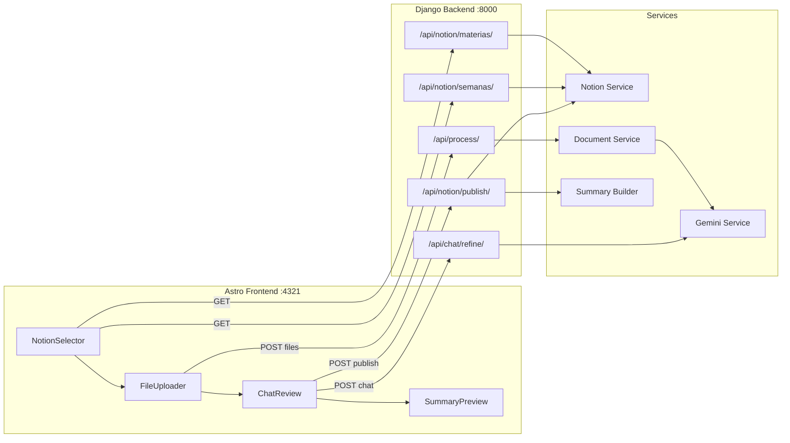

# EduSync AI — Implementation Plan

## Overview

Build a premium web application that processes class files (PDF, PPTX, DOCX) using Google Gemini AI to generate "Súper Resúmenes" that sync directly to the user's **"Notas de Clase"** Notion database.

**Stack**: Astro + Tailwind CSS v4 (Frontend) + Django REST (Backend) + Gemini API (AI) + Notion API (Integration)

---

## Notion Database Schema (Live Data)

Based on direct API inspection, the target database is:

| Property | Type | Details |
|----------|------|---------|
| **Database ID** | — | `63337178-cfe0-82e1-a478-012eccf8b9f3` |
| **`Materia`** | `select` | 6 options: SEGURIDAD INFORMÁTICA, FUNDAMENTOS DEL MÉTODO CIENTÍFICO, BIG DATA Y ANALÍTICA DE DATOS, PROYECTO FINAL DE CARRERA I, FORMACIÓN DE EMPRESAS DE BASE TECNOLÓGICA II, PLAN DE NEGOCIOS |
| **`Nombre`** | `title` | Pattern: "Semana N - Anotaciones" |

**Flow**: User selects Materia → filters pages by that Materia → selects a "Semana" page → summary is appended as blocks to that page.

---

## User Review Required

> [!IMPORTANT]
> **API Keys Needed**: You will need to provide the following API keys (stored in `.env` files, never committed):
> 1. **Notion Integration Token** — from https://www.notion.so/my-integrations  
> 2. **Google Gemini API Key** — from https://aistudio.google.com/apikey
>
> These will be configured in `backend/.env` before running.

> [!WARNING]
> **CORS**: The Astro dev server runs on `localhost:4321` and Django on `localhost:8000`. Django will be configured with `django-cors-headers` to allow cross-origin requests. In production, you'd serve both from the same domain or configure explicit origins.

> [!IMPORTANT]
> **Notion API Limitation**: The Notion API only allows appending blocks (max ~100 per request). For very long summaries, we'll batch the block creation into multiple API calls.

---

## Project Structure

```
d:\EduSync AI\
├── frontend/                     # Astro (SSR mode)
│   ├── astro.config.mjs
│   ├── package.json
│   ├── public/
│   │   └── fonts/
│   ├── src/
│   │   ├── layouts/
│   │   │   └── Layout.astro         # Base layout (dark theme, fonts)
│   │   ├── pages/
│   │   │   └── index.astro          # Main single-page app
│   │   ├── components/
│   │   │   ├── NotionSelector.jsx   # React island: Curso + Semana selectors
│   │   │   ├── FileUploader.jsx     # React island: drag & drop upload
│   │   │   ├── ChatReview.jsx       # React island: review chat panel
│   │   │   ├── SummaryPreview.jsx   # React island: rich summary preview
│   │   │   ├── ProgressBar.jsx      # Processing status indicator
│   │   │   └── Header.jsx           # App header/branding
│   │   └── styles/
│   │       └── global.css           # Tailwind v4 @theme config + design tokens
│   └── .env                         # PUBLIC_API_URL=http://localhost:8000
│
├── backend/                      # Django REST Framework
│   ├── manage.py
│   ├── requirements.txt
│   ├── edusync/                  # Django project
│   │   ├── settings.py
│   │   ├── urls.py
│   │   └── wsgi.py
│   ├── api/                      # Django app
│   │   ├── views.py              # API endpoints
│   │   ├── urls.py               # Route definitions
│   │   ├── serializers.py        # Request/response validation
│   │   ├── services/
│   │   │   ├── notion_service.py     # Notion API read/write
│   │   │   ├── gemini_service.py     # Gemini multimodal processing
│   │   │   ├── document_service.py   # PDF/PPTX/DOCX extraction
│   │   │   └── summary_builder.py    # Notion block structure builder
│   │   └── utils/
│   │       └── notion_blocks.py      # Helper: text → Notion block objects
│   └── .env                      # NOTION_TOKEN, GEMINI_API_KEY, NOTION_DB_ID
│
└── README.md
```

---

## Proposed Changes

### Component 1: Backend (Django REST API)

---

#### [NEW] `backend/requirements.txt`
Python dependencies:
- `django>=5.0` — Web framework
- `djangorestframework>=3.15` — REST API toolkit
- `django-cors-headers>=4.3` — CORS for Astro frontend
- `python-dotenv>=1.0` — Environment variable management
- `notion-client>=2.2` — Official Notion SDK for Python
- `google-generativeai>=0.8` — Google Gemini API SDK
- `PyMuPDF>=1.24` — PDF text + image extraction (fast)
- `python-pptx>=1.0` — PowerPoint extraction
- `python-docx>=1.1` — Word document extraction
- `Pillow>=10.0` — Image processing

#### [NEW] `backend/edusync/settings.py`
Django config with:
- REST framework config (JSON renderer/parser)
- CORS allowed origins = `["http://localhost:4321"]`
- File upload max size = 25MB
- No database needed (stateless processing)

#### [NEW] `backend/api/urls.py`
Four REST endpoints:

| Method | Endpoint | Purpose |
|--------|----------|---------|
| `GET` | `/api/notion/materias/` | Get unique Materia values from Notion DB |
| `GET` | `/api/notion/semanas/?materia=X` | Get pages filtered by Materia |
| `POST` | `/api/process/` | Upload files → extract → Gemini summarize |
| `POST` | `/api/chat/refine/` | Chat refinement of the summary |
| `POST` | `/api/notion/publish/` | Write final summary as Notion blocks |

#### [NEW] `backend/api/services/notion_service.py`
- `get_materias()` → queries DB `63337178-cfe0-82e1-a478-012eccf8b9f3`, extracts unique `Materia` select options
- `get_semanas(materia)` → filters DB pages where `Materia.select.name == materia`, returns `[{id, nombre}]`
- `publish_summary(page_id, blocks)` → appends Notion block children to the target page (batched in chunks of 100)

#### [NEW] `backend/api/services/document_service.py`
- `extract_from_pdf(file)` → PyMuPDF: returns `{text, images[]}` where images are base64-encoded page renders for diagrams
- `extract_from_pptx(file)` → python-pptx: returns `{text, images[]}` from slide shapes
- `extract_from_docx(file)` → python-docx: returns `{text, images[]}` from paragraphs and embedded images
- For PDF: renders each page as image at 150 DPI for Gemini multimodal analysis

#### [NEW] `backend/api/services/gemini_service.py`
- `generate_summary(text, images[], context)` → sends multimodal prompt to Gemini:
  - System prompt in Spanish requesting the "Súper Resumen" structure
  - Text content + page images (for diagram interpretation)
  - Returns structured JSON with: `temas`, `puntos_clave`, `analisis_visual`, `glosario`, `quiz`
- `refine_summary(current_summary, user_message)` → chat-based refinement
- Uses `gemini-2.0-flash` model for speed + multimodal capability

#### [NEW] `backend/api/services/summary_builder.py`
Converts the Gemini JSON output into Notion API block objects:
- **Heading 1** → Temas
- **Heading 2** → Subtemas
- **Bulleted list** → Puntos clave
- **Callout blocks** (💡) → Análisis visual
- **Toggle blocks** → Glosario (Term → Definition + Analogy)
- **Callout blocks** (❓) → Quiz questions with hidden answers in toggles
- **Divider blocks** between sections

---

### Component 2: Frontend (Astro + React Islands)

---

#### [NEW] `frontend/` — Astro project
Created via: `npm create astro@latest ./frontend -- --yes --template minimal --typescript relaxed --install --no-git`

React integration added via: `npx astro add react`

#### [NEW] `frontend/src/styles/global.css`
Tailwind CSS v4 con design tokens "Sage Intelligence" (de Stitch):
- **Configuración CSS-first** vía `@import "tailwindcss"` + `@theme { ... }`
- **Color palette**: Verdes botánicos (primary #2a6b44, secondary #3f6758, tertiary #2e6771)
- **Glassmorphism** suave con surface al 70% opacity + backdrop-blur 20px
- **Typography**: Lexend (headlines) + Plus Jakarta Sans (body) from Google Fonts
- **Micro-animations**: fade-in, slide-up, pulse-glow, shimmer loading
- **Roundness**: FULL — mínimo 1rem border-radius
- **3-panel layout**: Sidebar + Workspace + AI Chat

#### [NEW] `frontend/src/layouts/Layout.astro`
Base HTML with:
- Dark theme meta tags, SEO tags, Google Fonts links
- Responsive viewport, favicon
- Global CSS import

#### [NEW] `frontend/src/pages/index.astro`
Single page app layout:
- **Left panel (60%)**: Header → NotionSelector → FileUploader → SummaryPreview
- **Right panel (40%)**: ChatReview (sticky sidebar)
- Mobile: stacks vertically with tab switching

#### [NEW] `frontend/src/components/Header.jsx`
- App branding with gradient logo text "EduSync AI"
- Connection status indicator (green dot when Notion connected)
- Animated logo icon

#### [NEW] `frontend/src/components/NotionSelector.jsx` (React island, `client:load`)
Two-step cascading selector:
1. **Curso dropdown**: Fetches `/api/notion/materias/`, displays colored chips matching Notion colors
2. **Semana dropdown**: On Curso selection, fetches `/api/notion/semanas/?materia=X`, shows "Semana N - Anotaciones" options
3. Stores selected `page_id` in component state for later publishing
- Glassmorphic dropdown cards with smooth transitions

#### [NEW] `frontend/src/components/FileUploader.jsx` (React island, `client:load`)
- Drag & drop zone with animated dashed border
- Accepts: `.pdf`, `.pptx`, `.docx`
- Multi-file support (up to 5 files, 25MB each)
- File preview cards with type icon, name, size
- Upload progress animation
- "Procesar con IA" button → POST to `/api/process/`

#### [NEW] `frontend/src/components/ChatReview.jsx` (React island, `client:load`)
Interactive review panel:
- Displays AI-generated summary outline on the right
- Chat input for refinement: "Enfócate más en los diagramas", "Agrega más ejemplos"
- Message bubbles (user/AI) with typing indicator animation
- "Publicar en Notion" floating button at bottom
- Calls `/api/chat/refine/` on each user message
- Calls `/api/notion/publish/` on final publish

#### [NEW] `frontend/src/components/SummaryPreview.jsx` (React island, `client:visible`)
- Rich markdown preview of the summary in Spanish
- Collapsible sections matching the Notion output structure
- Syntax highlighting for any code blocks
- Visual indicators for each section (📚 Temas, 🔑 Puntos Clave, 🖼️ Análisis Visual, 📖 Glosario, ❓ Quiz)

#### [NEW] `frontend/src/components/ProgressBar.jsx`
- Multi-step progress indicator: Upload → Extracción → IA Processing → Revisión → Publicado
- Animated gradient bar with step labels

---

## Architecture Diagram



---

## Data Flow

```
1. User opens app
2. Frontend fetches Materias from Django → Django queries Notion DB → returns select options
3. User selects "BIG DATA Y ANALÍTICA DE DATOS"
4. Frontend fetches Semanas filtered by that Materia → returns [{id, "Semana 2 - Anotaciones"}, ...]
5. User selects "Semana 3 - Anotaciones" → page_id stored: "32d37178-cfe0-800c-9dca-fb302b326aa0"
6. User uploads PDF/PPTX files via drag & drop
7. Frontend POSTs files to /api/process/
8. Django: extract text + images → send to Gemini with Spanish Súper Resumen prompt
9. Gemini returns structured JSON summary
10. Django returns summary to frontend → displayed in ChatReview panel
11. User refines via chat → Django forwards refinement to Gemini → updated summary
12. User clicks "Publicar en Notion"
13. Django: converts summary JSON → Notion block objects → appends to page_id via Notion API
14. Frontend shows success with link to Notion page
```

---

## Open Questions (Resueltas)

> [!NOTE]
> 1. **Gemini API Key**: ✅ Obtenida
> 2. **Notion Integration Token**: ✅ Obtenido
> 3. **Python Version**: ❌ No instalado — Requiere instalar Python 3.11+
> 4. **Node.js Version**: ❌ No instalado — Requiere instalar Node.js 18+
> 5. **File Size Limits**: Confirmado 25MB máx. por archivo, 5 archivos máximo.

> **Decisiones adicionales confirmadas**:
> - Uso personal, sin autenticación
> - Solo uso local (sin despliegue)
> - Historial local en archivos JSON
> - Design system "Sage Intelligence" (light theme, verdes botánicos) desde Stitch
> - Sin logo (solo texto "EduSync AI")
> - Materias dinámicas desde Notion
> - Archivos principalmente en español
> - Secciones del Súper Resumen confirmadas como están

---

## Verification Plan

### Automated Tests
1. **Backend**: Run Django API endpoints with test files to verify:
   - Notion Materias/Semanas retrieval
   - Document extraction (PDF, PPTX, DOCX)
   - Gemini summary generation
   - Notion block publishing
2. **Frontend**: Start dev servers and verify:
   - `npm run dev` on Astro starts without errors
   - Component rendering and API communication

### Manual Verification
1. **Full flow test**: Upload a real class PDF → generate summary → review in chat → publish to Notion
2. **Verify Notion output**: Check that the published blocks appear correctly in the target "Semana - Anotaciones" page
3. **Browser recording**: Record the full user flow as a demo video
